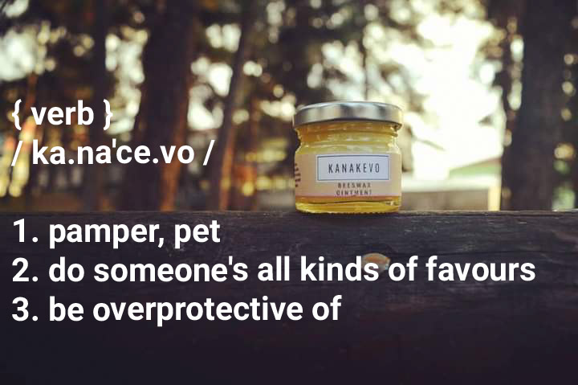
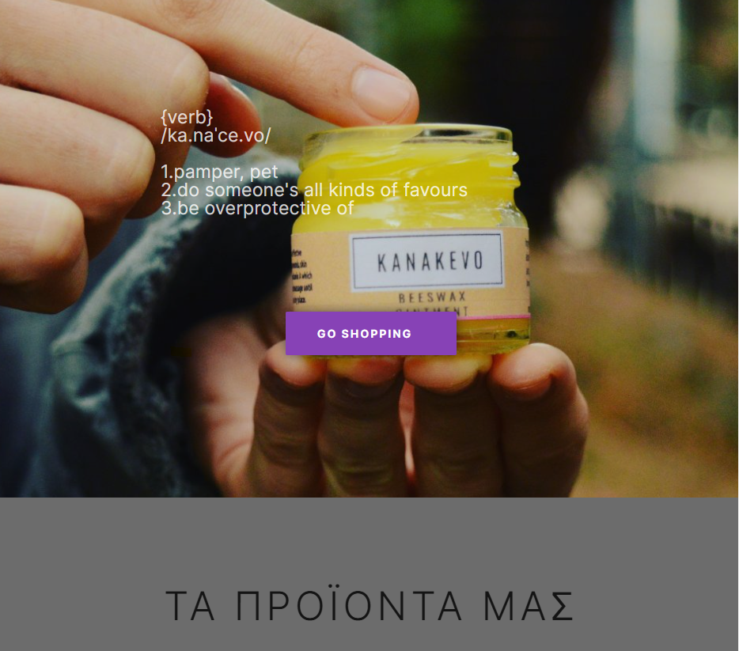
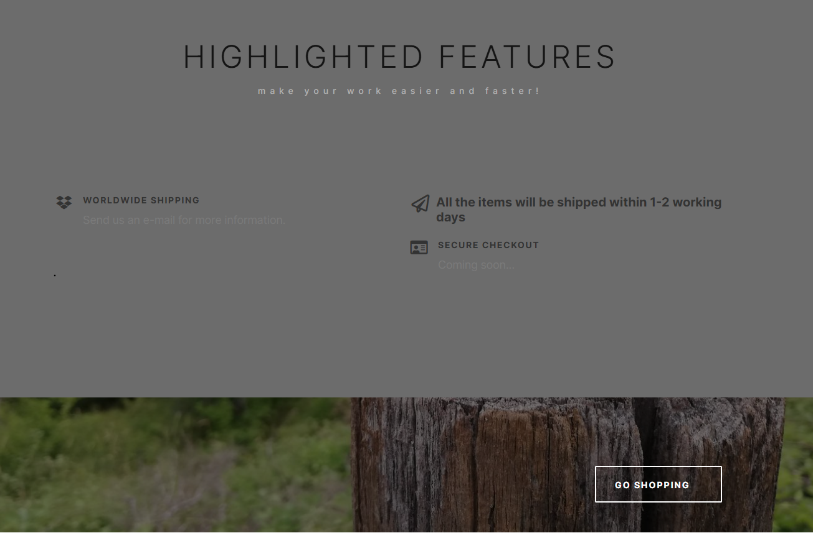
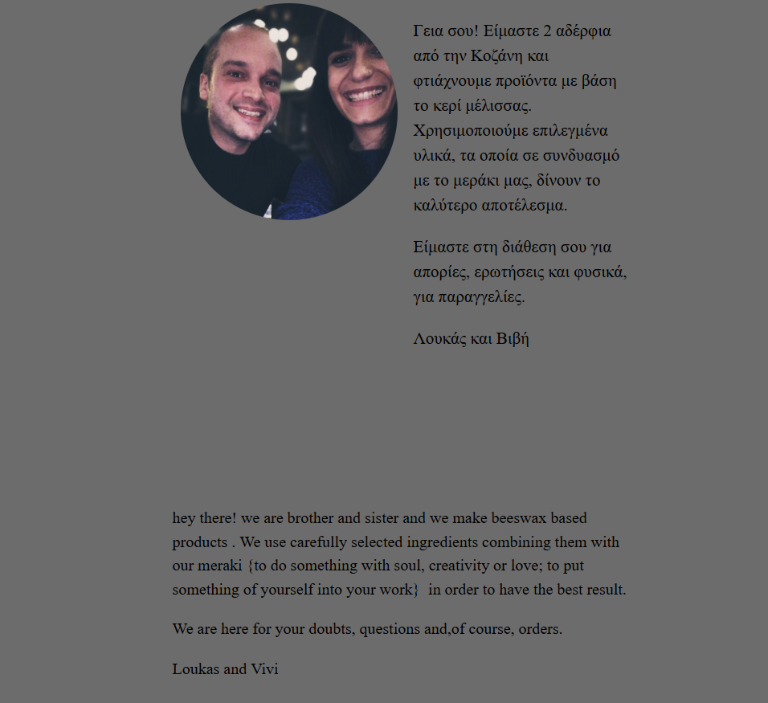
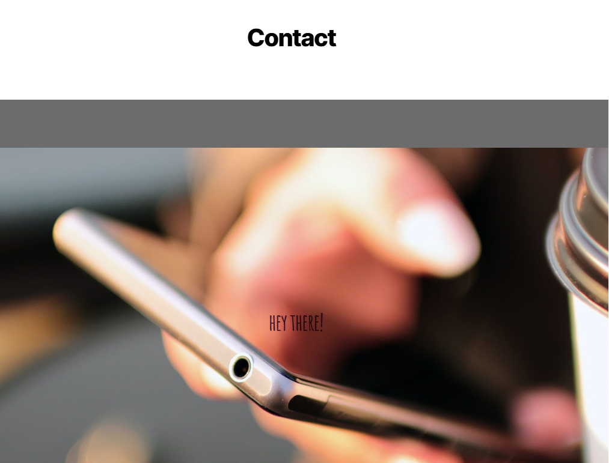

# Kanakevo Custom WordPress Project

A custom WordPress website developed to showcase handmade products and support independent creators who do not have their own web presence.

---

## 👥 Authors & Contributors
* **Loukas Paschopoulos** ([@lpaschopoulos](https://github.com/lpaschopoulos)) - Lead Developer / Creator
* **Vivi** ([@Vaia-Pasch](https://github.com/Vaia-Pasch)) - Co-Creator & Collaborator
---

## 📸 Screenshots

### Homepage (Hero & Products)

### About Us Section (Loukas and Vivi)

### Contact Section

---

## 🤝 Project Philosophy (Co-Buddies)

This project was built with a strong focus on community, collaboration, and mutual support among creators of handmade goods. Below is the original outreach message sent to potential partners (**co-buddies**), which perfectly encapsulates the core purpose and functionality of the platform:

> "Hello! We also create handmade products. We have set up a website showcasing our items, and we want to feature individuals who work with handmade crafts in our 'Co-Buddies' (Collaborations) section. If you’d like, you can send us a photo of your handmade work, a short bio about yourself, and the links where interested buyers can order from you. This is completely free of charge, of course. The website is brand new, and we are looking to build partnerships.
>
> We don’t want you to send us your physical products, nor will orders go through us. We simply want to promote people who create handmade goods but don’t have their own website. I will send you the link so you can take a look at the 'Co-Buddies' section, see what another creator wrote about herself, what she sells, and how her link directs users directly to her Instagram page. We play no part in her orders. Our site is new and we want to build its visibility, which is why we don't ask for any fee."
> 
> — **kanakevo.com**

---

## 🛠️ Tech Stack & Structure
* **CMS:** WordPress
* **Page Builder:** Elementor
* **Database:** MySQL (`database.sql` included for local environment setup)
* **File Structure:** Includes the complete `wp-content` directory (excluding the `uploads` folder due to file size constraints).